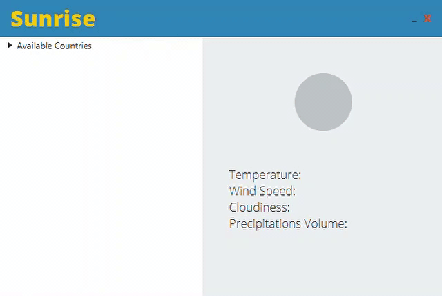

# Sunrise :sunrise_over_mountains:

## Description :framed_picture:

**Sunrise** is a `Java` **weather app**. Just select an available city and weather information will be shown.

## Setup :wrench:

1. **import the project** into IntelliJ
2. **download the JavaFX SDK** from [Gluon website](https://gluonhq.com/products/javafx/) and place it into the `sunrise/lib` folder
3. **create a new IntelliJ build profile**, with the *VM Options* field set to `--module-path ABSOLUTE_PATH\sunrise\lib\javafx-sdk-VERSION\lib --add-modules=javafx.controls,javafx.fxml`
4. **create a configuration file** named `sunrise.conf` in the folder `sunrise/src/main/resources`, containing the text `api_key=OPENWEATHER_API_KEY`
5. **build** and **run**
6. *create an executable via IntelliJ artifacts (optional)*

### Notations :question:

- `ABSOLUTE_PATH`, the absolute path to the repository
- `VERSION`, the version of the downloaded JavaFX SDK
- `OPENWEATHER_API_KEY`, the API key of your OpenWeather account

## Resources :books:

| Name                 | Description                                                                    | Link                                                             | 
|----------------------|--------------------------------------------------------------------------------|------------------------------------------------------------------|
| **OpenWeather API**  | API for weather data                                                           | [website](https://openweathermap.org/api)                        |
| **JavaFX**           | `Java` platform for development of desktop applications                        | [website](https://openjfx.io/)                                   |
| **json-simple**      | `Java` library for working with JSON data                                      | [website](https://cliftonlabs.github.io/json-simple/)            |
| **Junit 5**          | `Java` testing library                                                         | [website](https://junit.org/junit5/)                             |
| **mockito**          | `Java` mocking library                                                         | [website](https://site.mockito.org/)                             |